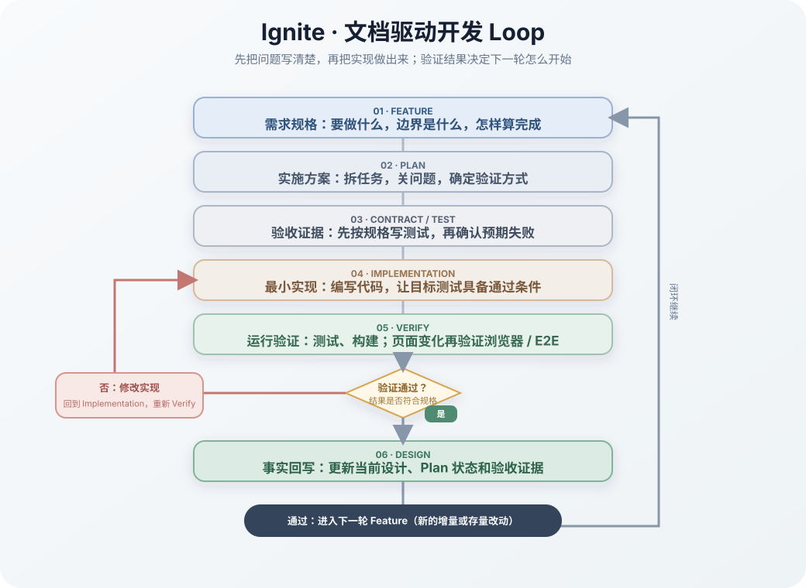
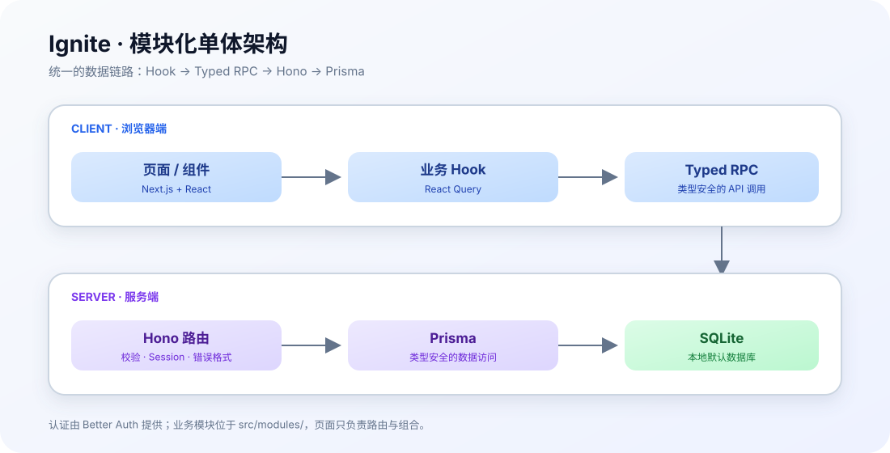

# Ignite

## 从一个问题开始，快速做出产品，并且继续做下去

> 一个面向个人开发者、独立产品和小团队的 AI 友好型全栈开发模板。

[快速开始](#开始使用) · [AI 开发 Loop](#ai-开发-loop) · [文档系统](#文档系统) · [基本架构](#基本架构)

[](https://nextjs.org/) [](https://react.dev/) [](https://hono.dev/) [](https://www.prisma.io/) [](https://www.typescriptlang.org/)

Ignite 是为快速解决真实问题准备的全栈开发模板。很多项目的开始都很相似：一个想法出现了，时间有限，最好马上做出一个能运行的版本。AI 让页面、接口和数据库的生成变得很快，真正困难的部分却常常出现在第一次修改之后：代码开始分散，边界变得模糊，AI 需要反复重新理解上下文，产品明明已经能跑，却越来越让人不敢继续碰。

Ignite 提供一个可以直接运行的起点，也把后续开发需要遵守的工程边界和验证方式组织起来。你可以从真正要解决的问题开始，快速做出第一个可验证的版本；之后每一次新增、修改和修复，都沿着同一条路径推进，项目不会因为追求速度而失去方向。

它尤其适合个人开发者、独立产品、比赛、黑客松和小团队的快速验证项目：你有明确的问题和时间压力，希望 AI 尽可能多地承担执行工作，同时仍然掌握产品方向、工程边界和交付质量。

Ignite 关心的结果很具体：让你更容易开始，在有限时间内交付一个真实可用的版本，并且在第一版完成后仍然有信心继续修改和扩展。

**一句话：**让 AI 负责执行，让工程规范守住方向，让产品持续向前。

---

## 🚀 AI 开发 Loop

每个功能都沿着同一条路径推进：

```text
问题 → Feature → Plan → Test → AI 实现 → Verify → Design → 下一轮增量
```



这套 Loop 的判断逻辑很明确：先把需求、约束和验收标准写进 Feature / Plan，再按规格编写测试和最小实现；运行测试后，结果决定下一步——通过就继续并更新 Design，不通过就修改代码、重新运行测试，直到验证通过。

开发规则固定为：**规格文档 → 编写测试 → 编写实现 → 运行测试 → 通过则继续 / 不通过则修复重试 → 更新 Design**。这条规则写入 [`AGENTS.md`](./AGENTS.md)，由测试和构建结果决定是否继续，而不是凭主观判断结束。

人确定问题、目标、边界和验收标准；AI 调查代码、实现功能、补充测试并整理结果；测试、构建和迁移检查为结果提供证据。

## 📚 文档系统

README 只负责入口和导航；具体规则都在文档系统中维护：

```text
AGENTS.md       AI 执行规则
standards/      长期工程标准
features/       功能需求和验收标准
plans/          每轮实现计划和过程记录
designs/        当前系统的最终事实
others/         ADR、测试用例和发布记录
tests/          可执行的验证证据
```

文档流转关系：

```text
Feature（需求起点） → Plan（过程方案） → Test + Code（实现与证据） → Design（最终事实）
```

简单记住：Feature 说明要做什么，Plan 说明这轮怎么做，Test 证明是否做对，Design 记录现在是什么；Standards 贯穿整个过程。

开始修改前，先阅读 [`AGENTS.md`](./AGENTS.md) 和 [`docs/README.md`](./docs/README.md)。

### 🧭 核心规格总览

Ignite 的详细规则统一收录在 [`docs/standards/`](./docs/standards/)；这里先记住几条总原则：

- **模板基线**：先理解并保留现有基线，再按项目需求做增量修改。
- **模块化组织**：新增能力进入独立模块，存量改动必须说明影响范围、兼容性和回归验证。
- **统一数据链路**：客户端通过 Hook 和 React Query，服务端通过 Hono Typed RPC，数据访问集中经过 Prisma。
- **规格驱动开发**：先写 Feature 和验收标准，再制定 Plan，实现后用 Test 验证，最后把结果更新到 Design。
- **可验证交付**：代码、测试、构建、迁移和文档共同构成交付证据；长期规则以 `AGENTS.md` 和 Standards 为准。

详细的架构、API、数据库、安全、测试、工作流和模板采用规则，统一从 [`docs/standards/README.md`](./docs/standards/README.md) 进入；需求、计划、设计和 ADR 等项目资料见 [`docs/README.md`](./docs/README.md)。

---

## ⚡ 开始使用

```bash
corepack enable
cp .env.example .env
pnpm install --frozen-lockfile
pnpm db:setup
pnpm dev
```

模板默认提供认证、数据库、API、UI、主题和测试基础；真实邮箱、支付、文件存储、队列等能力按项目需要增量接入。

---

## 🧩 基本架构

Ignite 采用**模块化单体架构**：前端和后端在同一个 Next.js 项目中组织，但每个业务能力都保持清晰的模块边界。



```text
页面 / 组件（Next.js + React）
          ↓
业务 Hook（React Query）
          ↓
Hono Typed RPC（类型安全的 API 调用）
          ↓
Hono 路由（服务端业务入口）
          ↓
Prisma（数据访问）
          ↓
SQLite（本地默认数据库）
```

通用界面由共享组件提供，业务代码放在 `src/modules/`，页面只负责组合和路由。认证由 Better Auth 处理；测试、文档和数据库迁移作为独立的工程保障层，共同围绕这条主链路工作。
