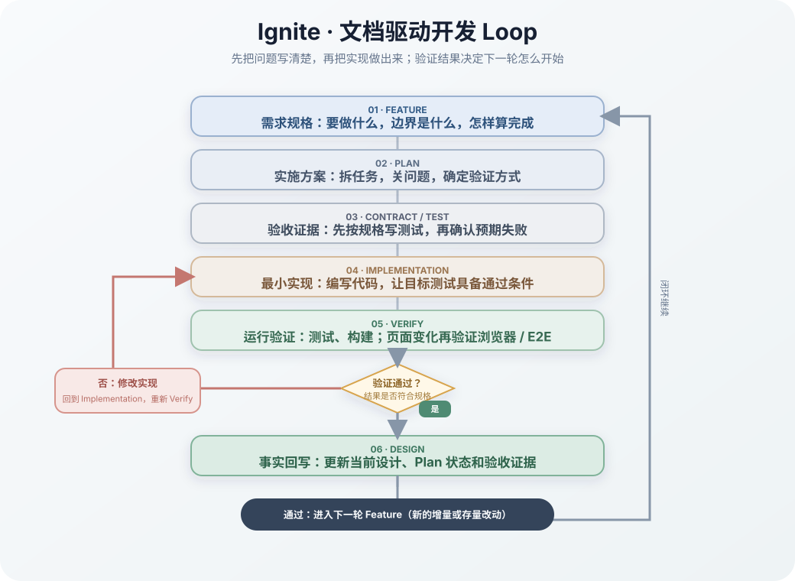
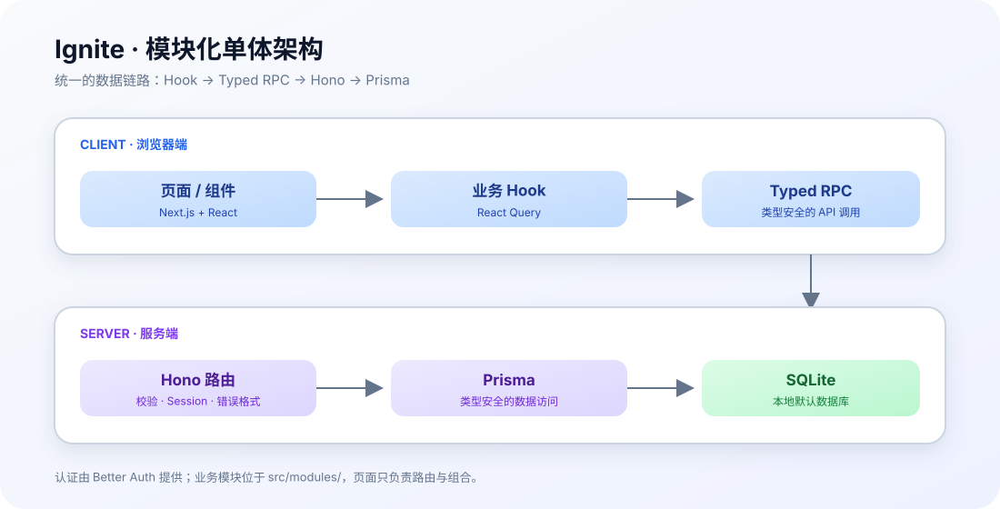

<div align="center">
  <h1>Ignite</h1>
  <p><strong>从一个问题开始，快速做出产品，并且继续做下去</strong></p>
  <p>一个面向个人开发者、独立产品和小团队的 AI 友好型全栈开发模板。</p>
  <p>
    <a href="https://github.com/morewhyhan/Ignite/generate"><strong>使用这个模板 ↗</strong></a>
    &nbsp; · &nbsp;
    <a href="#开始使用">快速开始</a>
    &nbsp; · &nbsp;
    <a href="./docs/README.md">阅读文档</a>
  </p>
</div>

<div align="center">

[](https://nextjs.org/) [](https://react.dev/) [](https://hono.dev/) [](https://www.prisma.io/) [](https://www.typescriptlang.org/)

</div>

**本页导航**　[AI 开发 Loop](#ai-开发-loop) · [文档系统](#文档系统) · [AI 工作台](#ai-工作台) · [核心规格](#核心规格总览) · [开始使用](#开始使用) · [基本架构](#基本架构) · [文档导航](#文档导航)

---

Ignite 是为快速解决真实问题准备的全栈开发模板。很多项目的开始都很相似：一个想法出现了，时间有限，最好马上做出一个能运行的版本。

AI 让页面、接口和数据库的生成变得很快，真正困难的部分却常常出现在**第一次修改之后**：代码开始分散，边界变得模糊，AI 需要反复重新理解上下文，产品明明已经能跑，却越来越让人不敢继续碰。

Ignite 提供一个可以直接运行的起点，也把后续开发需要遵守的工程边界和验证方式组织起来。你可以从真正要解决的问题开始，快速做出第一个可验证的版本；之后每一次新增、修改和修复，都沿着同一条路径推进，项目不会因为追求速度而失去方向。

它尤其适合**个人开发者、独立产品、比赛、黑客松和小团队的快速验证项目**：你有明确的问题和时间压力，希望 AI 尽可能多地承担执行工作，同时仍然掌握产品方向、工程边界和交付质量。

Ignite 关心的结果很具体：让你更容易开始，在有限时间内交付一个真实可用的版本，并且在第一版完成后仍然有信心继续修改和扩展。

> **一句话：**让 AI 负责执行，让工程规范守住方向，让产品持续向前。

---

<a id="ai-开发-loop"></a>

## 🚀 AI 开发 Loop

每个功能都沿着同一条路径推进：

```text
问题 → Feature → Plan → Test → AI 实现 → Verify → Design → 下一轮增量
```

<p align="center">
  
</p>

这套 Loop 的判断逻辑很明确：先把需求、约束和验收标准写进 Feature / Plan，再按规格编写测试和最小实现；运行测试后，结果决定下一步——通过就继续并更新 Design，不通过就修改代码、重新运行测试，直到验证通过。

开发规则固定为：**规格文档 → 编写测试 → 编写实现 → 运行测试 → 通过则继续 / 不通过则修复重试 → 更新 Design**。这条规则写入 [`AGENTS.md`](./AGENTS.md)，由测试和构建结果决定是否继续，而不是凭主观判断结束。

人确定问题、目标、边界和验收标准；AI 调查代码、实现功能、补充测试并整理结果；测试、构建和迁移检查为结果提供证据。

<details>
<summary>接续开发：查看状态与命令</summary>

查看 Ignite CLI 的命令和用法：`pnpm ignite --help`。开始任务时先用 `pnpm ignite status` 读取精简状态；需要自动化消费完整字段时再使用 `pnpm ignite status --json`。

具体操作见[开发工作流](./docs/standards/workflow.md)，验证方式见[测试规范](./docs/standards/testing.md)。

</details>

---

<a id="文档系统"></a>

## 📚 文档系统

README 只负责入口和导航；具体规则都在文档系统中维护：

```text
AGENTS.md       AI 执行规则（宪法）
CLAUDE.md       Claude Code 入口
.cursor/        Cursor 规则桥接
.claude/        Claude 本地资产登记
.opencode/      OpenCode 入口
.ai/            AI 工具资产登记（Skills / MCP）
docs/
├── standards/ 长期工程标准
├── features/  功能需求和验收标准
├── plans/     每轮实现计划和过程记录（从空模板开始）
├── designs/   当前系统的最终事实
└── others/    ADR、测试用例和项目产生的交付证据
tests/          可执行的验证证据
```

文档流转关系：

```text
Feature（需求起点） → Plan（过程方案） → Test + Code（实现与证据） → Design（最终事实）
```

简单记住：Feature 说明要做什么，Plan 说明这轮怎么做，Test 证明是否做对，Design 记录现在是什么；Standards 贯穿整个过程。

> **Plan 保留这一轮的过程，Design 保存系统当前的事实。** 下一轮从现行需求与设计出发，接续相关计划。

发布快照只携带可复用资料。复制后从自己的第一份 Plan 开始，Ignite 建设期的任务、审计报告和运行记录保存在 Git 历史中。

开始修改前，先阅读 [`AGENTS.md`](./AGENTS.md) 和 [`docs/README.md`](./docs/README.md)。

<details>
<summary>交付结果如何留下可核对的依据</summary>

AI 不靠“我觉得完成了”结束任务：Plan 绑定真实 Git 基线、验收标准和测试；检查范围由实际差异决定且不能被降级；通过结果绑定输入、运行环境和 commit，Release 状态再由这些证据自动推导。完整日志只留在本机，仓库只保存脱敏证据摘要。

</details>

<a id="ai-工作台"></a>

### 🤖 AI 工作台

Ignite 使用“一份宪法，多端引用”：所有工具都从 [`AGENTS.md`](./AGENTS.md) 开始，再按任务读取 `docs/`。其中 [`docs/designs/`](./docs/designs/) 管理当前系统事实；Claude Code、Cursor、OpenCode 和 GitHub Copilot 的入口只负责引用这些真源，不各自维护一套规则。

工具入口与配置：[AI 工作台](./.ai/README.md) · [AI 协作规范](./docs/standards/ai-agents.md)。

<a id="核心规格总览"></a>

### 🧭 核心规格总览

Ignite 的详细规则统一收录在 [`docs/standards/`](./docs/standards/)；这里先记住几条总原则：

- **[模板基线](./docs/standards/adoption.md)**：先理解并保留现有基线，再按项目需求做增量修改。
- **[模块化组织](./docs/standards/architecture.md)**：新增能力进入独立模块，存量改动必须说明影响范围、兼容性和回归验证。
- **[统一数据链路](./docs/standards/api.md)**：客户端通过 Hook 和 React Query，服务端通过 Hono Typed RPC，数据访问集中经过 Prisma。
- **[规格驱动开发](./docs/standards/workflow.md)**：先写 Feature 和验收标准，再制定 Plan，实现后用 Test 验证，最后把结果更新到 Design。
- **[可验证交付](./docs/standards/testing.md)**：代码、测试、构建、迁移和文档共同构成交付证据；长期规则以 `AGENTS.md` 和 Standards 为准。

详细的架构、API、数据库、安全、测试、工作流和模板采用规则，统一从 [`docs/standards/README.md`](./docs/standards/README.md) 进入；需求、计划、设计和 ADR 等项目资料见 [`docs/README.md`](./docs/README.md)。

### 文档导航

按你当前要做的事情，进入对应文档：

| 你现在想做什么               | 从这里开始                                                                        |
| ---------------------------- | --------------------------------------------------------------------------------- |
| 把模板用于自己的项目         | [模板采用指南](./docs/standards/adoption.md)                                      |
| 了解已有功能与验收要求       | [功能规格索引](./docs/features/README.md)                                         |
| 理解文档如何分工与流转       | [文档系统导览](./docs/README.md)                                                  |
| 让 AI 开始或接续一轮开发     | [开发工作流](./docs/standards/workflow.md) · [计划与执行](./docs/plans/README.md) |
| 查当前模块、接口与数据设计   | [当前设计索引](./docs/designs/README.md)                                          |
| 查架构、安全、测试等工程约定 | [工程标准索引](./docs/standards/README.md)                                        |
| 配置 AI 工具与项目资产       | [AI 工作台](./.ai/README.md) · [AI 协作规范](./docs/standards/ai-agents.md)       |
| 查看验收、决策与版本更新     | [验收与决策资料](./docs/others/README.md) · [版本更新](./CHANGELOG.md)            |

---

<a id="开始使用"></a>

## ⚡ 开始使用

通过 [Use this template](https://github.com/morewhyhan/Ignite/generate) 创建自己的仓库并克隆到本地，在项目根目录运行：

```bash
nvm install "$(tr -d '\r\n' < .node-version)"
nvm use "$(tr -d '\r\n' < .node-version)"
corepack enable
node --version # 应与 .node-version 完全一致
node scripts/runtime-doctor.mjs --preflight
cp .env.example .env
pnpm install --frozen-lockfile
pnpm runtime:check
pnpm db:setup
pnpm dev
```

打开 [localhost:3000](http://localhost:3000)，注册后即可体验工作台和 Tasks 示例。默认使用本地 SQLite，无需配置真实邮箱服务。功能说明见[产品基线](./docs/features/product.md)、[账户认证](./docs/features/auth.md)和 [Tasks](./docs/features/tasks.md)。

默认推荐在 WSL/Linux x64 中完成安装和开发。若切换到 Windows，先删除并重新安装该平台的 `node_modules`；不要让 Windows 与 WSL 共享原生依赖。

模板默认提供认证、数据库、API、UI、主题和测试基础；真实邮箱、支付、文件存储、队列等能力按项目需要增量接入。

> 以上步骤用于启动 Ignite 模板基线。复制为自己的项目后，先按[模板采用规范](./docs/standards/adoption.md)确定名称、外壳、Tasks 去留与交付目标，再验证那个项目；模板通过不代表衍生项目已经通过。

---

<a id="基本架构"></a>

## 🧩 基本架构

Ignite 采用**模块化单体架构**：前端和后端在同一个 Next.js 项目中组织，但每个业务能力都保持清晰的模块边界。

<p align="center">
  
</p>

<details>
<summary>展开查看文字版请求链路</summary>

```text
页面 / 组件（Next.js + React）
          ↓
业务 Hook（React Query）
          ↓
Hono Typed RPC（类型安全的 API 调用）
          ↓
Hono 路由（服务端业务入口）
          ↓
Prisma（数据访问）
          ↓
SQLite（本地默认数据库）
```

</details>

通用界面由共享组件提供，业务代码放在 `src/modules/`，页面只负责组合和路由。认证由 Better Auth 处理；测试、文档和数据库迁移作为独立的工程保障层，共同围绕这条主链路工作。

[架构规范](./docs/standards/architecture.md) · [API 设计](./docs/designs/api.md) · [数据库设计](./docs/designs/database.md) · [返回文档导航 ↑](#文档导航)
